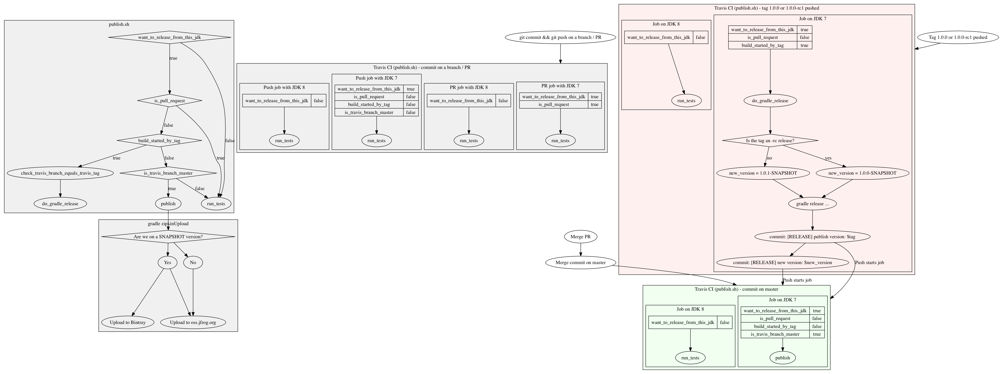

# Zipkin Release Process

1. **Verify that the build you're releasing is green**

   There is currently no automated testing during the release process. As the person pushing a release tag,
   you'll need to manually check that the test [run on Travis](https://travis-ci.org/openzipkin/zipkin) is green for
   the commit you're tagging. (Building tooling for this would be awesome.)

1. **Push a git tag**

   For release candidates, this should be something like `1.2.2-rc1`. For final releases, it's just `1.2.2`.

1. **Wait for Travis CI**

   This part is controlled by [`travis/publish.sh`](travis/publish.sh). It creates a bunch of new commits, bumps
   the version if this was a final (non-RC) release, publishes `SNAPSHOT` and non-`SNAPSHOT` artifacts (`SNAPSHOT` artifacts
   are published for each build on `master`). A high-level overview of how the release happens for RC and final releases:

   

   A detailed view at the process:

   

1. **Sync to Maven Central**

   Publishing to Maven Central currently happens by manually pushing the "Sync" button on
   [Bintray](https://bintray.com/openzipkin/maven/zipkin#central) after the release has finished.
   This is required because automated sync requires a synchronous call to the Bintray API for
   publishing the just released version, and that consistently times out (PR [#82](https://github.com/bintray/gradle-bintray-plugin/pull/82)
   in [`zipkin-gradle-plugin`](https://github.com/bintray/gradle-bintray-plugin/) may help with that).

1. **Publish `docker-zipkin`**

   Refer to [docker-zipkin/RELEASE.md](https://github.com/openzipkin/docker-zipkin/blob/master/RELEASE.md).
